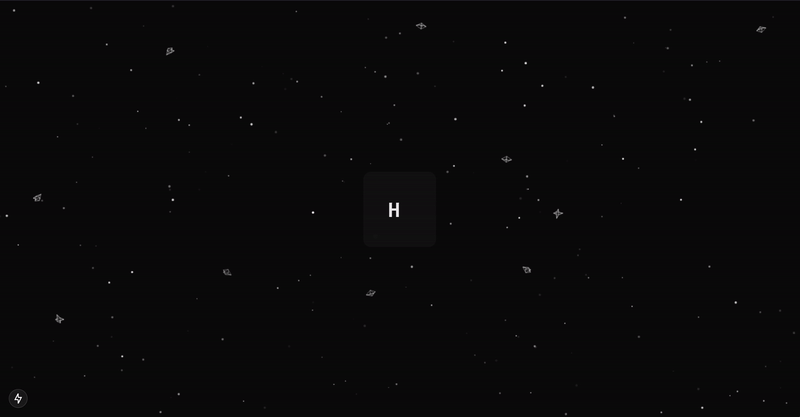

IN EARLY DEVELOPMENT.

## Quickstart/Code Examples:

### Starfield landscape demo:



##### Next.js + Tailwind:

#### layout.tsx

```typescript
"use client";
import "./globals.css";
import { Starfield } from "battlezone-shapes"
import { Inconsolata } from 'next/font/google'

const font = Inconsolata({
  subsets: ['latin'],
  weight: ['400', '500', '700'],
})

export default function RootLayout({
  children,
}: Readonly<{
  children: React.ReactNode;
}>) {
  return (
    <html lang="en">
      <body className={`${font.className} flex flex-col min-h-screen w-full`}>
        <Starfield className="fixed inset-0 -z-10"/>
        {children}
      </body>
    </html>
  );
}
```
